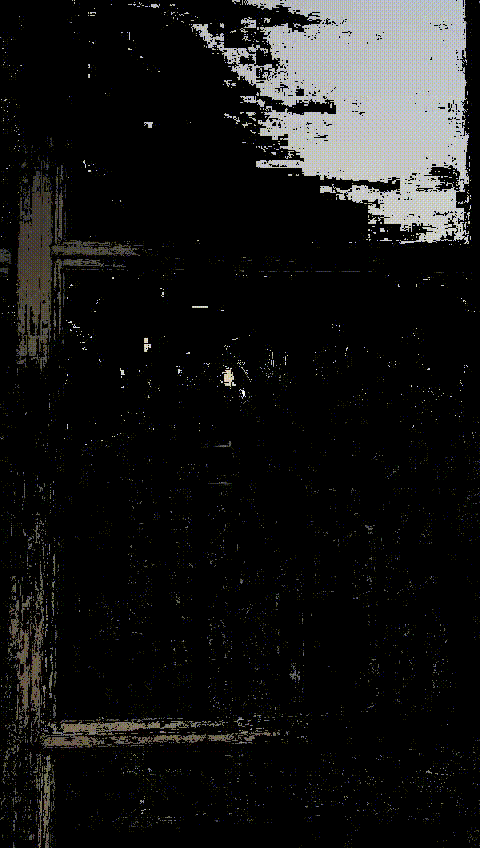
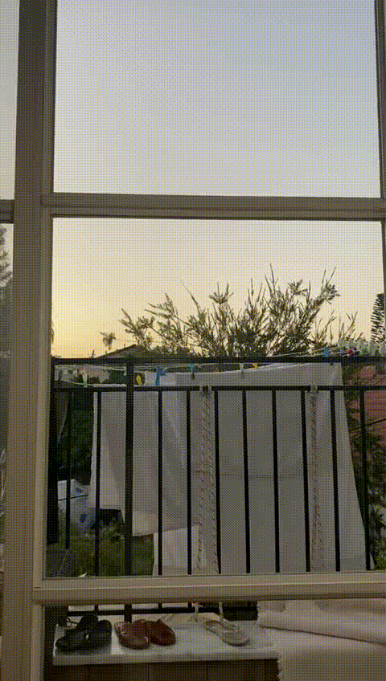

# Separating Video to Reflection & Transmission 
Based on mathematical calculations from each frame its MSE (mean squared error) is changing differently from frame to frame.  
So when a reflection object moves in the video we were able to remove it from the frame,  
because that amount of pixels is a sum of the Reflection + Transmission (which assumed to be not moving).  
Then taking the minimum values from each pixel in a window size of X number we were able to remove it.

## Steps of process:
A video can be shaky when taken. so in order to fix that we had to stabilize it (which was the more challenging part).  
So:
1. Stabilize Video
2. Remove Reflection
3. Subtract (Origin Video - Transmission Video) == Reflection Video 

### pip install to your project
pipenv install git+https://github.com/BenK93/OpenCV-Reflection-Seperation.git#egg=video_separation
# Result: 

<table>
  <tr>
    <th style="font-size: large">Reflection</th>
    <th style="font-size: large">Origin</th>
    <th style="font-size: large">Transmission</th>
  </tr>

  <tr>
    <td></td>
    <td></td>
    <td></td>
  </tr>

</table>

